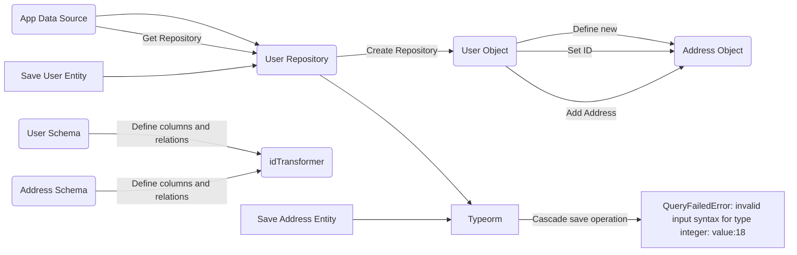

# Minimum Reproducible Example for Id transformation error

Steps to run this project:

1. Run `npm i` command
2. Run `docker compose up` to bootstrap a local instance of the database
3. Run `npm test` command to see the test failing

## The error

 
## Problem Description

We're experiencing an issue with the TypeORM library in the context of saving entities with relations.

Our application uses a Value Object `Id` for the id attribute in each model. To correctly manage this, we employ the `transform` option in the entity schemas (please refer to the `UserSchema` and `AddressSchema` code snippets). This transformation is defined in the idTransformer function.

The `User` entity has a `one-to-many` relation to the `Address` entity. As such, when a new `User` is created and saved, we attempt to add an `Address` object to this user and save it again. This is done in the hope that the address entity would be persisted in the database as part of a cascading save operation.

Unfortunately, during the second save operation, the application throws the error `QueryFailedError: invalid input syntax for type integer: "{"value":18}".`

Investigation shows that this issue arises because TypeORM does not appear to execute the `idTransformer` during the cascading save operation for the `Address` entity. As a result, the transformation of the id value from `Id` type to integer (expected by TypeORM and the underlying database) does not occur.

The Mermaid chart above provides a visualization of the process and the point at which the issue occurs. The `User` object is defined and provided an `Address` object. When the `User` entity is saved for the second time, we expect a cascading save operation to persist the `Address` object to the database. However, this is when the `QueryFailedError` is triggered.

We appreciate any assistance in resolving this issue. The error interrupts a core functionality of our application and we're keen on a prompt resolution.